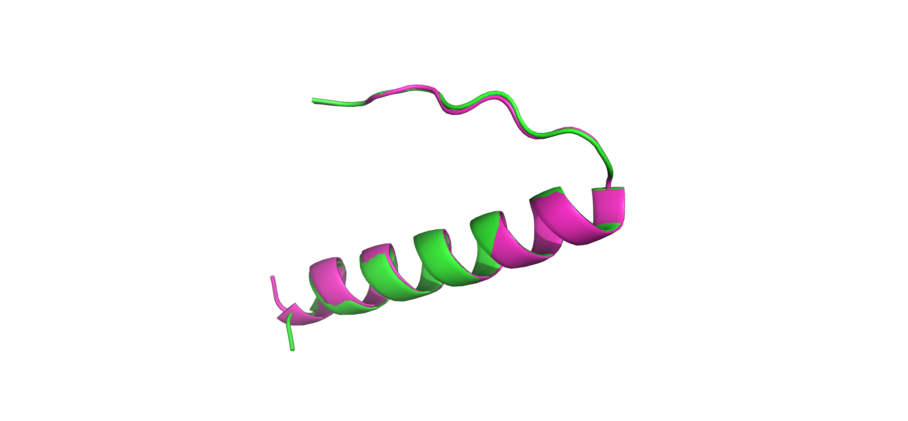

> Authors 
- M0hamed (m0hamed.essamit2000@gmail.com)
- Adiba (1998adiba@gmail.com)
- Funbee (phunbeee3@gmail.com)
- Uwais (uwaisunura04@gmail.com)

# COMPARATIVE ANALYSIS OF P53 PROTEIN STRUCTURE USING HOMOLOGY MODELING AND ALPHAFOLD

## Introduction
p53 is a tumor suppressor protein involved in DNA repair, apoptosis, and cell cycle regulation. It’s often called the "guardian of the genome" because it helps maintain genomic integrity by repairing DNA or inducing cell death when damage is irreparable. The TP53 gene is located on chromosome 17, encodes p53 and controls cell proliferation. Mutations in TP53 disrupt these functions, leading to uncontrolled cell division and tumor formation (Canale et al., 2022).

## Structural Domains and Function of p53 Protein
p53 consists of several key domains:
* **N-terminal transactivation domain (TAD, residues 1–61)** activates transcription by binding coactivators.
* **Proline-rich domain (PRD, residues 64–92)** is involved in signal transduction and apoptosis.
* **DNA-binding domain (DBD, residues 96–292)** binds DNA to regulate gene expression, crucial for cell cycle arrest and apoptosis.
* **Tetramerization domain (TET, residues 324–356)** allows p53 to form functional tetramers, essential for its activity.
* **C-terminal regulatory domain (CTD, residues 364–393)** controls p53 activity through post-translational modifications, influencing its DNA binding and stability.
## Incorporation of p53 Potency through Homology Modeling for Cancer research Insights:
The initiation and validation of p53 protein into cancer research incorporation directs for protein template selection of homology modeling. For an ideal p53 functionality testing, a p53 tetreamerization domain crystal culture has been selected. 
This model is secured under the PDB ID: 1AIE.
DOI: https://www.wwpdb.org/pdb?id=pdb_00001aie
The crystal model of p53 serves as an independent entity with core functioning data, devoid of any coherence or association with external molecules. 

Using the data derived from the PDB ID, the FASTA sequence derived from this protein model is used further in SWISS-MODEL to extract templates of the highest homogeneity and uniformity corresponding with the selected protein structure. 
At least 50 templates were generated through SWISS-MODEL from which a directly aligned prototype of 1AIE was recovered (1AIE.1.D). The selected template shows existing data of the p53 protein of interest
.png)

The template model stands with 90% of accuracy (GMQE data) in the alignment results corresponding to the PDB data of p53, providing the highest accuracy levels amongst all the templates generated. The template model is externally validated using X-ray mechanisms and matches with a 100% identification rate to the protein crystal structure. 

The graph represents the redundancy manner of the selected protein template model that locates in between the expected rates of QMEAN scores, referring it to be a potential model for homology modeling and visualization. 

## Cancer-related Mutations 
Mutations in TP53, particularly in the DNA-binding domain, are common in cancers. These mutations impair p53's ability to suppress tumors, either through loss of function or gain-of-function (GOF) mutations that promote cancer progression. Hotspot mutations like R175, R248, and R273 occur frequently in ovarian, colorectal, and lung cancers. These changes affect p53’s ability to bind DNA and regulate genes involved in preventing uncontrolled cell growth.

## Comparison protein structures 
**AlphaFold** predicts protein structures using deep learning techniques, generating models based on evolutionary data. For p53, AlphaFold produced five models, each showing different alignments and Root Mean Square Deviation (RMSD) values. 

**SWISS-MODEL** uses homology modeling to predict protein structures from related known templates and generates a biological assembly, which is four asymmetric units.

## Accuracy and Performance 
The original p53 structure from the Protein Data Bank (PDB) was aligned with models from AlphaFold and SWISS-MODEL. AlphaFold’s best model showed an RMSD of 0.220 across 26 atoms, while SWISS-MODEL had an RMSD of 0.055 across 27 atoms, indicating a closer fit to the original structure.

## Conclusion
SWISS-MODEL provided a better alignment with the original p53 structure, as reflected by lower RMSD values, making it a more accurate representation compared to AlphaFold.

## References

Baugh, E. H., Ke, H., Levine, A. J., Bonneau, R. A., & Chan, C. S. (2018). Why are there hotspot mutations in the TP53 gene in human cancers? Cell Death and Differentiation, 25(1), 154–160. https://doi.org/10.1038/cdd.2017.180

Canale, M., Andrikou, K., Priano, I., Cravero, P., Pasini, L., Urbini, M., Delmonte, A., Crinò, L., Bronte, G., & Ulivi, P. (2022). The role of TP53 mutations in EGFR-mutated non-small-cell lung cancer: Clinical significance and implications for therapy. Cancers, 14(5), 1–21. https://doi.org/10.3390/cancers14051143

Gu, J., Zhou, Y., Huang, L., Ou, W., Wu, J., Li, S., Xu, J., Feng, J., & Liu, B. (2016). TP53 mutation is associated with a poor clinical outcome for non-small cell lung cancer: Evidence from a meta-analysis. Molecular and Clinical Oncology, 5(6), 705–713. https://doi.org/10.3892/mco.2016.1057

Hephzibah Cathryn, R., & George Priya Doss, C. (2023). Comparative molecular dynamics simulation of apo and holo forms of the P53 mutant C176F: A structural perspective. Journal of Taibah University for Science, 18(1). https://doi.org/10.1080/16583655.2023.2297457

Mirgayazova, R., Khadiullina, R., Chasov, V., Mingaleeva, R., Miftakhova, R., Rizvanov, A., & Bulatov, E. (2020). Therapeutic editing of the TP53 gene: Is crispr/CAS9 an option? Genes, 11(6), 1–17. https://doi.org/10.3390/genes11060704

Wiegering, A., Matthes, N., Mühling, B., Koospal, M., Quenzer, A., Peter, S., Germer, C. T., Linnebacher, M., & Otto, C. (2017). Reactivating p53 and inducing tumor apoptosis (RITA) enhances the response of RITA-sensitive colorectal cancer cells to chemotherapeutic agents 5-fluorouracil and oxaliplatin. Neoplasia, 19(4), 301-309. https://doi.org/10.1016/j.neo.2017.01.007 

Images are available on: https://github.com/m1d0e1/Stage2/tree/main/images
